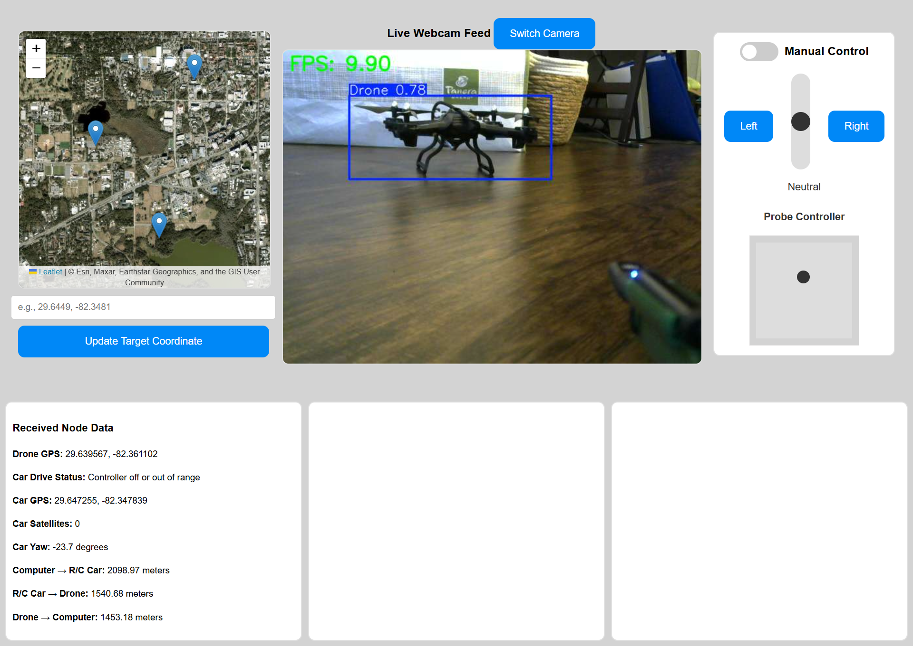

SETUP:
* git clone this project
* ensure python is downloaded
* ensure flask is downloaded (python -m pip install flask)
* ensure openvs is downloaded (python -m pip install opencv-python-headless)

If using the Jetson Nano Super:

1. Put the RCFLASK directory into the /python_tests/ directory from the drone-home repository

2. The Docker container from the drone-home repository contains all dependencies and will auto launch the website.

To use application:

1. In the RCFLASK dir, run 'python3 app.py' or 'python app.py' - whichever version you have

2. Click on website popup that appears after ~15s

[To edit application, use VS Code, preferably.]

Current Display:

BlueSky Design:

To set Location Permissions, go to the directory and in the terminal run:

openssl req -x509 -newkey rsa:4096 -keyout key.pem -out cert.pem -days 365 -nodes

Then enter: US Florida Gainesville - - 127.0.0.1 -
