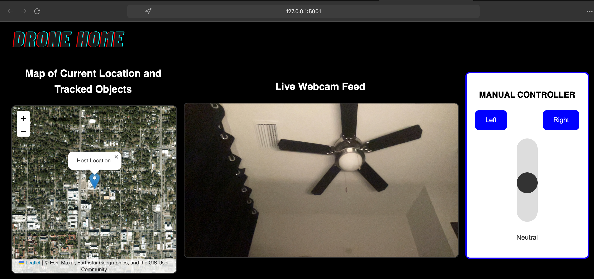
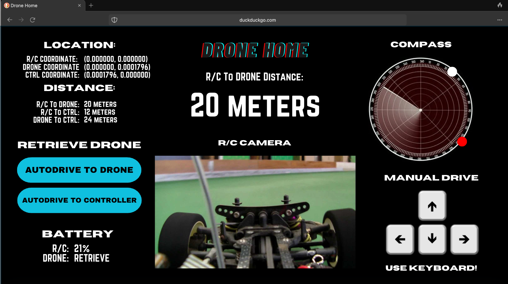

To use application:

1. In this dir, run 'python3 app.py'

2. Click on website

To set Location Permissions, go to the directory and in the terminal run:

openssl req -x509 -newkey rsa:4096 -keyout key.pem -out cert.pem -days 365 -nodes

Then enter: US Florida Gainesville - - 127.0.0.1 -

To connect to mobile, do the following:

1. Download Ngrok from ngrok.com

2. Run 'python3 app.py'

3. In a new terminal, run 'ngrok http http://localhost:5001'

4. On your mobile device, run the link it gives you.
    i.e. https://a2ec-184-185-222-10.ngrok-free.app

Current Design:

BlueSky Design:

BUGS!:

Using mobile is INCOMPLETE, and currently shows up like this:

