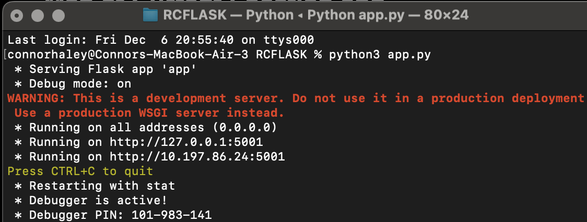
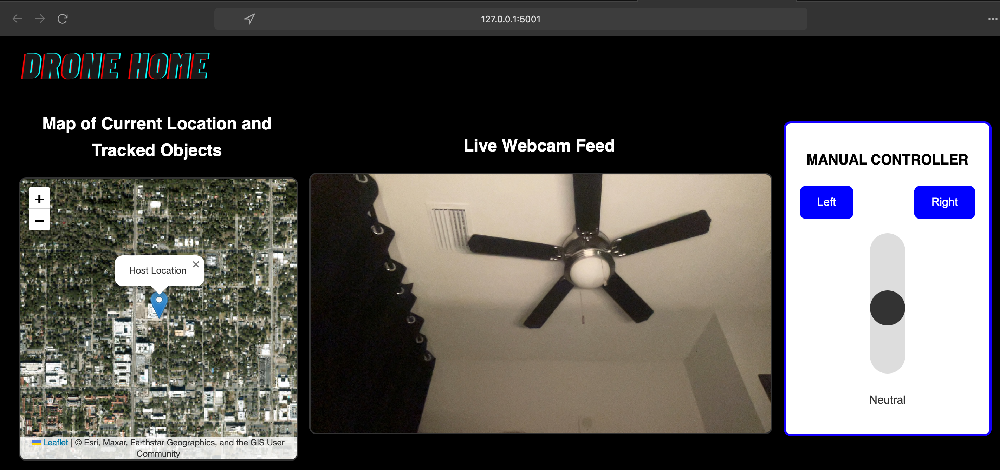
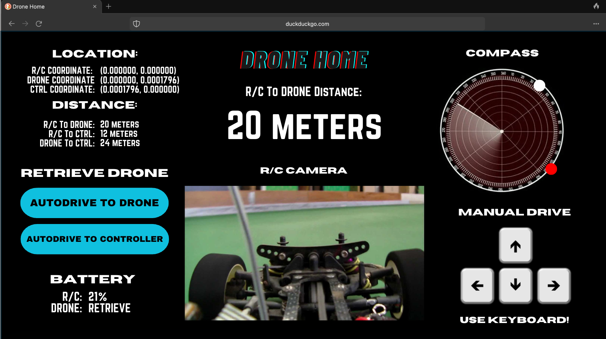
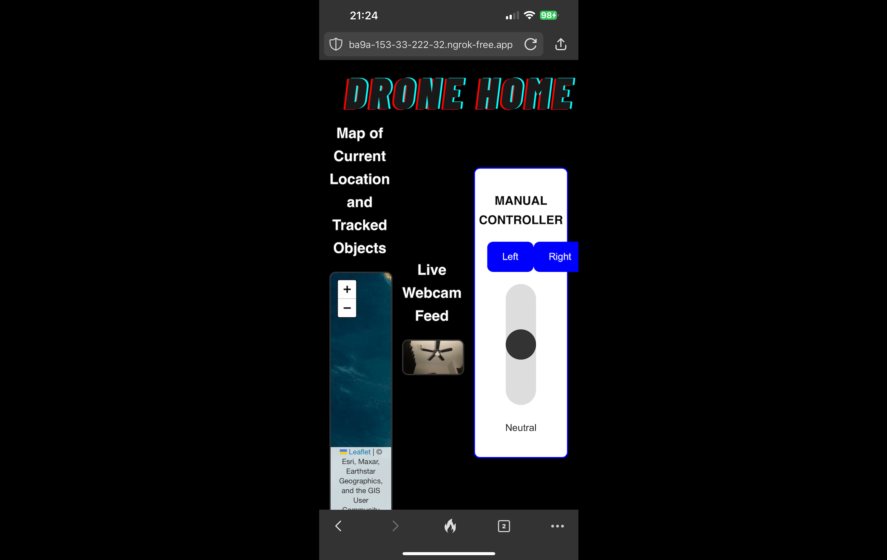

To use application:

1. In this dir, run 'python3 app.py'

2. Click on website displayed in Terminal (i.e. http://127.0.0.1:5001)

Example:

*

To set Location Permissions:

1. In this dir, run 'openssl req -x509 -newkey rsa:4096 -keyout key.pem -out cert.pem -days 365 -nodes'

2. It will ask for information. Enter: US, Florida, Gainesville, -, -, 127.0.0.1, -

3. It is important to use the proper I.P. of the url being accessed ^

*

To connect to mobile, do the following:

1. Download Ngrok from ngrok.com

2. Run 'python3 app.py'

3. In a new terminal, run 'ngrok http http://localhost:5001'

4. On your mobile device, run the link it gives you.
    i.e. https://a2ec-184-185-222-10.ngrok-free.app

Current Design:

BlueSky Design:

BUGS!:

Using mobile is INCOMPLETE, and currently shows up like this:

Thus, the mobile page is currently unusable and should not be run. Only run the website via local computer url, such as Safari, Chrome, or DuckDuckGo.

